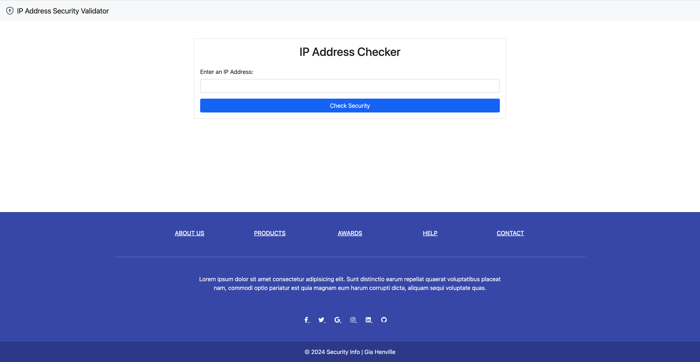
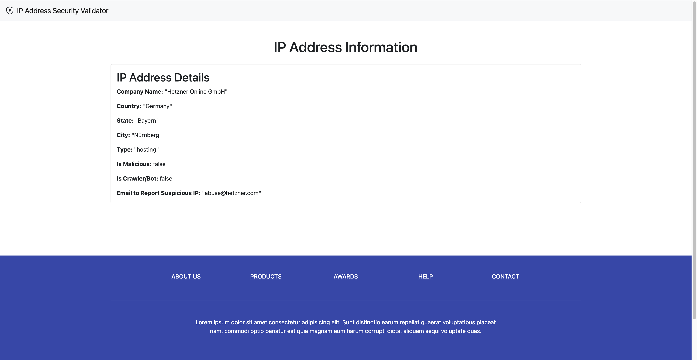

# IP Address Security Validator

## Overview

[![View Demo Here!]](https://youtu.be/fxanLI7vEt8)

This is a full-stack, responsive web application where a user can enter an IP address and learn useful security information about it, including the owning company, its location, the type of IP address, whether it is malicious or a crawler, and an email address for reporting abuse. 

I used the ipapi.is public API to build this application using the Express/Node.js platform and the Axios HTTP client. This project demonstrates how to retrieve, manipulate, and present data from an API in a user-friendly manner.

## Technologies Used
- Node.js
- Express.js
- Axios
- EJS (Embedded JavaScript templating)
- body-parser middleware
- Bootstrap
- CSS

## Features
- **IP Address Input**: Users can enter an IP address to check its security.
- **API Integration**: The application uses a public API to retrieve security information about the entered IP address.
- **Data Presentation**: Retrieved data is presented in a user-friendly manner using Bootstrap for styling.
- **Error Handling**: Errors from the API and application are caught and displayed to the user.
- **Responsive Design**: The website is styled with Bootstrap to ensure it is responsive and looks good on all devices.
